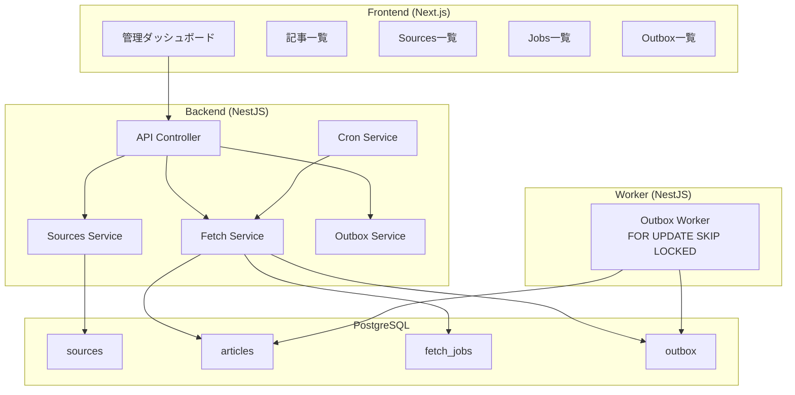

# RSS記事取得システム構築計画

## アーキテクチャ概要



## 実装ステップ（検証しやすい粒度）

### Phase 0: プロジェクト初期化とGitリポジトリセットアップ

**目標**: プロジェクトの基盤を整え、バージョン管理を開始する

1. **Gitリポジトリの初期化**

   - `git init` でリポジトリ初期化
   - 初期コミット（空のREADME.mdなど）

2. **.gitignore の設定**

   - Node.js用（`node_modules/`, `.env`, `dist/`, `build/` など）
   - IDE用（`.vscode/`, `.idea/` など）
   - OS用（`.DS_Store`, `Thumbs.db` など）
   - Prisma用（`prisma/migrations/` は含める、生成ファイルは除外）

3. **README.md の作成**

   - プロジェクト概要
   - 技術スタック
   - セットアップ手順（後で更新）
   - 開発コマンド（後で更新）

4. **LICENSE ファイルの追加**（オプション）

   - MIT, Apache 2.0 など適切なライセンスを選択

**検証ポイント**: `git status` で適切なファイルが追跡されていることを確認

---

### Phase 1: 基盤構築と動作確認

**目標**: 開発環境が立ち上がり、基本的なAPI疎通を確認できる

1. **Docker Compose セットアップ**

   - 3コンテナ構成: `app` (NestJS API), `worker` (NestJS Worker), `postgres` (PostgreSQL)
   - `backend/Dockerfile` の作成（NestJSアプリケーション用）
     - マルチステージビルド（ビルドステージ + 実行ステージ）
     - Node.js 18以上を使用
     - Prismaクライアント生成を含む
     - 開発環境用のホットリロード対応（volumes設定）
   - ネットワーク設定
   - 環境変数管理（`.env.example`）
   - ボリューム設定（DB永続化）

2. **NestJS プロジェクト初期化**

   - `nest new` でプロジェクト作成
   - 必要な依存関係インストール:
     - `@nestjs/schedule` (Cron)
     - `@nestjs/swagger` (OpenAPI)
     - `@prisma/client`, `prisma` (DB)
     - `rss-parser` (RSS取得)
   - 基本的なモジュール構造
   - ログ設定: Nest Logger をJSON形式に設定（`winston` など使用）

3. **Prisma セットアップ**

   - Prisma 初期化とスキーマ定義（最小限のテーブル: `sources`, `articles`, `fetch_jobs`, `outbox`）
   - マイグレーション実行
   - PrismaService 作成

4. **OpenAPI (Swagger) セットアップ**

   - `@nestjs/swagger` の設定
   - Swagger UI の有効化（`/api` エンドポイント）
   - DTO へのデコレータ追加準備

5. **ヘルスチェック実装**

   - `GET /healthz` エンドポイント
   - DB疎通確認（`SELECT 1`）
   - 役割判定（`pg_is_in_recovery()`）

**検証ポイント**: Docker Compose 起動 → DB接続確認 → `/healthz` が200を返す

**補足**:

- 開発用シードデータ: Phase 2完了後にテスト用のsourceを1-2件登録しておくと検証しやすい
- CORS設定: Phase 2でフロントエンド接続前にCORS設定を追加

---

### Phase 2: Sources管理（CRUD）

**目標**: RSSフィードの登録・管理ができる

1. **Sources API実装**

   - `GET /sources` - 一覧取得
   - `POST /sources` - 登録（url, name, enabled）
   - `PATCH /sources/:id` - 更新（有効/無効切り替え）
   - `DELETE /sources/:id` - 削除
   - Swagger デコレータ追加（DTO定義）
   - **バリデーション**: URL形式チェック（`class-validator`）、RSS URLの妥当性検証（オプション）
   - **エラーハンドリング**: 重複URL防止、存在しないsourceの操作時の適切なエラー返却

2. **フロントエンド（Sources管理画面）**

   - Next.js プロジェクト初期化（App Router）
   - Tailwind CSS + shadcn/ui セットアップ
   - TanStack Query セットアップ
   - **openapi-typescript セットアップ**: Swagger JSONから型生成スクリプト作成
   - Sources一覧表示（TanStack Query）
   - Sources登録フォーム

**検証ポイント**: フロントからSourcesを登録 → DBに保存される → 一覧に表示される

---

### Phase 3: フィード取得（手動実行）

**目標**: 手動でRSSフィードを取得し、記事を保存できる

1. **RSS取得ロジック**

   - `rss-parser` を使用したフィード取得
   - エラーハンドリング（タイムアウト、不正URL等）

2. **手動取得API**

   - `POST /sources/:id/fetch` - 指定sourceの手動取得
   - ジョブ履歴の保存（`fetch_jobs` テーブル）
   - 成功/失敗/所要時間の記録

3. **Articles保存**

   - `articles` テーブルへの Upsert（`url` をUNIQUE制約）
   - `ON CONFLICT DO UPDATE` で冪等性確保
   - **外部キー制約**: `sourceId` への参照整合性確保
   - **インデックス**: `url` (UNIQUE), `sourceId`, `publishedAt`（記事一覧のソート・フィルタ用）
   - **データ正規化**: 不要なHTMLタグの除去、文字列長制限

4. **フロントエンド（手動取得ボタン）**

   - Sources一覧に「取得」ボタン追加
   - ローディング状態表示
   - 成功/失敗の通知

**検証ポイント**: 手動取得ボタンクリック → RSS取得 → 記事がDBに保存される → ジョブ履歴が記録される

---

### Phase 4: 記事一覧表示

**目標**: 取得した記事をフロントエンドで確認できる

1. **Articles API**

   - `GET /articles` - 一覧取得（クエリパラメータ: `query`, `sourceId`, `sort`, `page`, `limit`）
   - ページネーション対応

2. **フロントエンド（記事一覧）**

   - 記事一覧表示（TanStack Query）
   - フィルタ（source選択）
   - 検索（タイトル/URL）
   - ソート（日付、タイトル）
   - ページネーション

**検証ポイント**: 記事一覧が表示される → フィルタ/検索/ソートが動作する

---

### Phase 5: Outboxパターン実装

**目標**: 記事保存と同時に非同期タスクを投入し、ワーカーで処理できる

1. **Outboxテーブル活用**

   - 記事保存トランザクション内で `outbox` にタスク投入
   - ステータス: `pending` → `processing` → `done` / `failed`

2. **ワーカー実装**

   - 別プロセス/コンテナとしてワーカー起動
   - Docker Compose に `worker` サービス追加（`backend` と同じイメージ、異なるエントリーポイント）
   - `FOR UPDATE SKIP LOCKED` でタスク取得
   - **ポーリング間隔**: 5秒ごとにチェック（設定可能に）
   - **タイムアウト処理**: `processing` 状態が長時間（例: 10分）続く場合の自動リセット
   - **デッドレターキュー（DLQ）**: リトライ上限（例: 3回）を超えたタスクの分離
   - サンプル処理（例: 記事タイトルの文字数カウント、タグ付け準備）
   - ワーカー専用のログ出力設定
   - **エラーハンドリング**: 処理失敗時の適切なログ記録とステータス更新

3. **Outbox API**

   - `GET /outbox` - 一覧取得（ステータスフィルタ）
   - `POST /outbox/:id/retry` - 失敗タスクの再実行

4. **フロントエンド（Outbox一覧）**

   - Outbox一覧表示
   - ステータス別フィルタ
   - リトライボタン

**検証ポイント**: 記事保存 → Outboxにタスク投入 → ワーカーが処理 → ステータスが `done` になる

**補足**: ワーカーは `docker-compose.yml` で `worker` サービスとして定義し、`npm run start:worker` などのエントリーポイントで起動

---

### Phase 6: Cron定期実行

**目標**: 指定したスケジュールで自動的にフィード取得が実行される

1. **Cron設定**

   - `@nestjs/schedule` を使用
   - sourceごとの取得間隔設定（例: 1時間ごと）
   - 実行中の重複防止

2. **ジョブ管理の強化**

   - ジョブ履歴の詳細表示
   - 失敗ジョブの詳細（エラーメッセージ、スタックトレース）

3. **フロントエンド（Jobs一覧）**

   - ジョブ履歴一覧表示
   - 成功/失敗の可視化
   - 平均実行時間の表示
   - 失敗詳細の表示

**検証ポイント**: Cronが設定時刻に実行される → ジョブ履歴に記録される → フロントで確認できる

---

### Phase 7: リトライ機能とエラーハンドリング強化

**目標**: 失敗したジョブやOutboxタスクを手動で再実行できる

1. **リトライAPI実装**

   - `POST /jobs/:id/retry` - 失敗ジョブの再実行
   - リトライ回数の制限

2. **エラーハンドリング**

   - 適切なHTTPステータスコード（4xx/5xxの使い分け）
   - エラーメッセージの統一フォーマット（`{ error: string, message: string, statusCode: number }`）
   - **グローバル例外フィルタ**: NestJSの`ExceptionFilter`で統一的なエラーレスポンス
   - ログ出力（JSON形式推奨）
   - **構造化ログ**: リクエストID、ユーザー操作、エラーコンテキストを含める

3. **フロントエンド（リトライ機能）**

   - Jobs一覧にリトライボタン
   - Outbox一覧にリトライボタン
   - リトライ結果の通知

**検証ポイント**: 失敗したジョブ/タスクをリトライ → 成功する

---

### Phase 8: リアルタイム更新（任意・発展）

**目標**: SSEでジョブ進捗やOutbox滞留を自動更新

1. **SSE実装**

   - `GET /events` エンドポイント
   - ジョブ状態変更の通知
   - Outbox滞留数の通知

2. **フロントエンド（SSE接続）**

   - EventSource で接続
   - 自動更新の実装

**検証ポイント**: ジョブ実行中にフロントが自動更新される

---

## ファイル構造（想定）

```


cron-larning/
├── backend/
│   ├── src/
│   │   ├── sources/
│   │   │   ├── sources.controller.ts
│   │   │   ├── sources.service.ts
│   │   │   └── sources.module.ts
│   │   ├── articles/
│   │   ├── fetch/
│   │   │   ├── fetch.controller.ts
│   │   │   ├── fetch.service.ts
│   │   │   └── fetch.module.ts
│   │   ├── jobs/
│   │   ├── outbox/
│   │   │   ├── outbox.controller.ts
│   │   │   ├── outbox.service.ts
│   │   │   ├── outbox.worker.ts
│   │   │   └── outbox.module.ts
│   │   ├── health/
│   │   ├── prisma/
│   │   │   └── prisma.service.ts
│   │   └── main.ts
│   ├── prisma/
│   │   └── schema.prisma
│   └── Dockerfile
├── frontend/
│   ├── app/
│   │   ├── (dashboard)/
│   │   │   ├── articles/
│   │   │   ├── sources/
│   │   │   ├── jobs/
│   │   │   └── outbox/
│   │   └── layout.tsx
│   └── Dockerfile
├── docker-compose.yml
├── .gitignore
├── .env.example
├── README.md
└── LICENSE
```

## 各Phaseの検証方法

- **Phase 1-2**: APIテスト（curl/Postman） + DB直接確認
- **Phase 3-4**: フロントエンド操作 + DB確認
- **Phase 5**: ワーカーログ確認 + Outboxテーブル確認
- **Phase 6**: 時間待ち or Cron時刻調整 + ログ確認
- **Phase 7-8**: エラー再現 → リトライ → 成功確認

## 優先順位

**必須（MVP）**: Phase 0-6

**推奨**: Phase 7

**任意**: Phase 8

---

## 補足事項

### 発展機能（将来の拡張）

- **タグ機能**: `tags`, `article_tags` テーブルの追加とタグ付け機能（Phase 5以降で検討）
- **監視**: Prometheus/Grafana の導入（後回しでOK）

### 技術的な注意点

- **型安全性**: フロントエンドでは `openapi-typescript` で生成した型を使用し、API変更時に型エラーで検知
- **ログ**: 本番環境ではJSON形式ログを推奨（ログ集約ツールとの連携が容易）
- **トランザクション**: 記事保存とOutbox投入は必ず同一トランザクション内で実行
- **冪等性**: 記事のUpsertは `url` をUNIQUE制約として確実に実装
- **インデックス設計**: 記事一覧のクエリパフォーマンスを考慮し、`sourceId`, `publishedAt` にインデックスを追加
- **カスケード削除**: source削除時の記事・ジョブ履歴の扱いを明確化（論理削除 or 物理削除）

### 実装上の推奨事項

1. **Phase 1で追加すべきもの**

   - CORS設定（`@nestjs/platform-express` の `enableCors`）
   - 環境変数のバリデーション（`@nestjs/config` の `Joi` など）
   - リクエストIDの付与（トレーシング用）

2. **Phase 3で考慮すべきもの**

   - RSS取得の並列実行制限（同時に3-5件まで）
   - 取得失敗時の詳細ログ（HTTPステータス、レスポンスボディの一部）

3. **Phase 5で考慮すべきもの**

   - ワーカーのスケーラビリティ（複数ワーカー起動時の動作確認）
   - Outboxテーブルのパーティショニング検討（大量データ時のパフォーマンス）

4. **Phase 6で考慮すべきもの**

   - Cron実行のメトリクス（実行回数、成功率、平均実行時間）
   - 外部Cronサービス（GitHub Actions、AWS EventBridge等）への移行準備

5. **開発体験の向上**

   - `docker-compose.yml` に `volumes` でホットリロード設定（開発時）
   - Prisma Studio の活用（`npx prisma studio`）
   - 開発用の簡単なシードスクリプト

6. **セキュリティ考慮**

   - 入力サニタイゼーション（XSS対策）
   - SQLインジェクション対策（Prismaが自動対応だが、生SQL使用時の注意）
   - レート制限（RSS取得APIの過剰リクエスト防止）